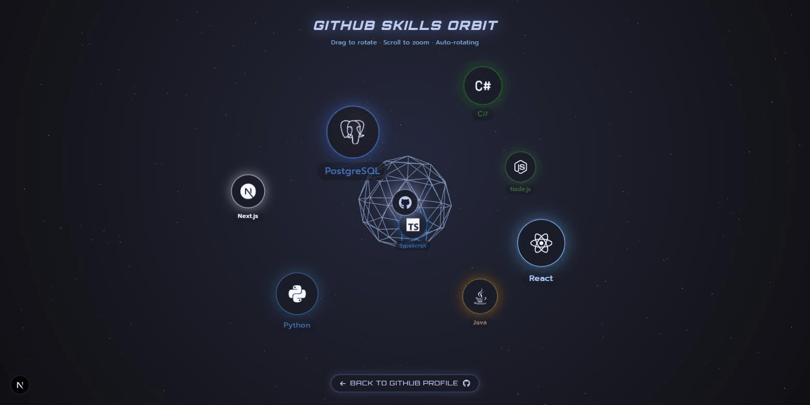

# 👋 Hi there, I’m Phuriphat Hemkul! (@PhuriphatTyPeZ3r0)

  

  

  
  **3rd Year Student in Computer Engineering and Artificial Intelligence**
   
  *Panyapiwat Institute of Management (PIM)*
  

---

## 🌟 About Me

- 👤 **Profile:** My name is **Phuriphat Hemkul**.
- 🎓 **Education:** Currently a **3rd Year Student** at **Panyapiwat Institute of Management**.
- 🏫 **Faculty & Major:** Studying **Computer Engineering and Artificial Intelligence** within the **Faculty of Engineering and Technology**.
- 💡 **Passion:** I specialize in **Object-Oriented Programming (OOP)**, **Software Architecture**, and **AI Technologies**.
- 🌐 **Full-Stack Development:** I build full-stack web applications across a range of domains — from healthcare and government services to gaming tools and computer vision.
- 🎮 **Game & Sim:** Strong interest in **Game Development** and **Simulation Systems** (physics, mechanics, and logic).
- 📚 **Goal:** Applying engineering mathematics and algorithmic thinking to solve real-world problems.

---

## 📚 Academic Background

Building a strong foundation in Engineering and AI within the Computer Engineering and Artificial Intelligence program at PIM, spanning:

- 🤖 **AI & Mathematics** — engineering mathematics, physics, and the mathematical foundations of AI
- 💻 **Software Engineering** — OOP, data structures & algorithms, and cross-platform programming
- 🌐 **Full-Stack & Cloud Systems** — databases, networking, cloud, and web development
- ⚡ **Hardware Fundamentals** — circuits, electronics, and engineering physics labs

---

## 🚀 Skills & Tools

### 💻 Languages & Scripting

### 🌐 Web Technologies

### 🛠 Tools & Databases

---

## 🪐 Interactive 3D Skills Orbit

A three.js / react-three-fiber scene where my core tech stack orbits a live GitHub hub — drag to rotate, scroll to zoom, or just let it auto-rotate.

_GitHub strips `<script>`/`<iframe>` out of README rendering, so this can't run inline here — click through for the real, interactive version._

**[→ Open the live 3D scene](https://bio-website-ten.vercel.app/github-orbit)**

---

## 💼 Featured Projects

| Project | Stack | Links |
| :--- | :--- | :--- |
| **RoV-SN-Tournament-Official** | TypeScript, PostgreSQL | [Live](https://ro-v-sn-tournament-official.vercel.app) · [Repo](https://github.com/PhuriphatTyPeZ3r0/RoV-SN-Tournament-Official) |
| **CKD-Diet-Tracker** | JavaScript, PostgreSQL | [Live](https://ckd-diet-tracker.vercel.app) · [Repo](https://github.com/PhuriphatTyPeZ3r0/CKD-Diet-Tracker) |
| **Bio-Website** | TypeScript | [Live](https://bio-website-ten.vercel.app) · [Repo](https://github.com/PhuriphatTyPeZ3r0/Bio-Website) |
| **Portfolio** | TypeScript | [Live](https://portfolio-phuriphatizamus-projects.vercel.app) · [Repo](https://github.com/PhuriphatTyPeZ3r0/Portfolio) |
| **Hand-to-Text** | Python | [Repo](https://github.com/PhuriphatTyPeZ3r0/Hand-to-Text) |

---

## 📊 GitHub Stats

  
  

---

## 📫 Connect with Me

| Platform | Link |
| :---: | :--- |
| **GitHub** | [@PhuriphatTyPeZ3r0](https://github.com/PhuriphatTyPeZ3r0) |
| **Email** | [phuriphathem@gmail.com](mailto:phuriphathem@gmail.com) |

